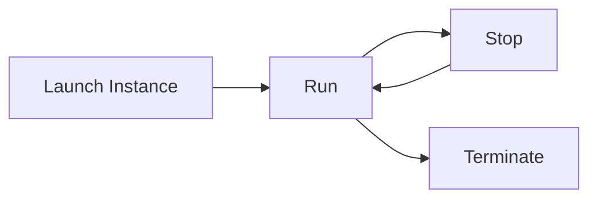
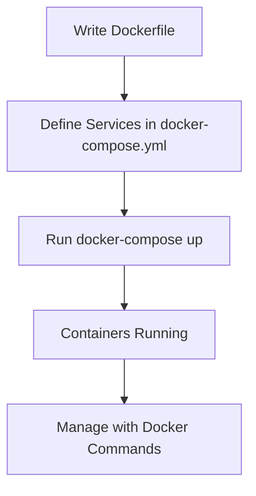

# 🐳 **Setup Docker on AWS EC2**

Deploying Docker containers on **Amazon EC2** (Elastic Compute Cloud) provides a scalable and flexible environment for your applications. This tutorial will guide you through the entire process, from understanding EC2 to deploying a sample Dockerized application.

---

## 📑 **Table of Contents**

1. [What is AWS EC2?](#what-is-aws-ec2)
2. [Prerequisites](#prerequisites)
3. [Step 1: Launch an EC2 Instance](#step-1-launch-an-ec2-instance)
4. [Step 2: Connect to Your EC2 Instance](#step-2-connect-to-your-ec2-instance)
5. [Step 3: Install Docker on EC2](#step-3-install-docker-on-ec2)
6. [Step 4: Deploy Your Dockerized Project](#step-4-deploy-your-dockerized-project)
7. [Example Project Deployment](#example-project-deployment)
8. [Managing Docker Services](#managing-docker-services)
9. [Security Best Practices](#security-best-practices)
10. [Conclusion](#conclusion)
11. [Additional Resources](#additional-resources)

---

## 🌐 **What is AWS EC2?**

**Amazon Elastic Compute Cloud (EC2)** is a web service that provides secure, resizable compute capacity in the cloud. It is designed to make web-scale cloud computing easier for developers.

### 📊 **Key Features of AWS EC2**

| **Feature**              | **Description**                                                                     |
| ------------------------ | ----------------------------------------------------------------------------------- |
| **Scalability**          | Easily scale compute resources up or down based on demand.                          |
| **Variety of Instances** | Wide range of instance types optimized for different tasks (e.g., compute, memory). |
| **Elastic IPs**          | Static IP addresses that can be reassigned to instances as needed.                  |
| **Security Groups**      | Virtual firewalls controlling inbound and outbound traffic to instances.            |
| **Integration**          | Seamlessly integrates with other AWS services like S3, RDS, and IAM.                |

### 🖼️ **EC2 Instance Lifecycle**



_Figure 1: EC2 Instance Lifecycle_

---

## ⚙️ **Prerequisites**

Before you begin, ensure you have the following:

- **AWS Account**: [Sign up here](https://aws.amazon.com/) if you don't have one.
- **SSH Key Pair**: For secure access to your EC2 instance.
- **Basic Linux Knowledge**: Familiarity with terminal operations.
- **Docker Fundamentals**: Basic understanding of Docker concepts.

---

## 🚀 **Step 1: Launch an EC2 Instance**

### 1. **Log in to AWS Management Console** 🖥️

Navigate to the [AWS Management Console](https://aws.amazon.com/console/) and sign in with your credentials.

### 2. **Navigate to EC2 Dashboard** 🛂

From the **Services** menu, select **EC2** under the "Compute" category.

### 3. **Launch Instance** ➕

Click on the **"Launch Instance"** button to start the setup process.

### 4. **Configure Instance Details** 📋

#### a. **Choose an Amazon Machine Image (AMI)** 🖥️

- **Recommendation**: **Ubuntu Server 20.04 LTS** – Reliable and widely supported.

#### b. **Choose an Instance Type** 🖱️

| **Instance Type** | **vCPUs** | **Memory (GB)** | **Use Case**              |
| ----------------- | --------- | --------------- | ------------------------- |
| t2.micro          | 1         | 1               | Low traffic websites      |
| t2.medium         | 2         | 4               | Small databases and apps  |
| m5.large          | 2         | 8               | Medium-sized applications |

- **t2.micro**: Eligible for the free tier, suitable for testing and small applications.

#### c. **Configure Instance Details** 🛠️

- **Number of Instances**: 1
- **Network Settings**: Default VPC is usually sufficient.
- **IAM Role**: Leave as default unless specific permissions are needed.

### 5. **Add Storage** 💾

- **Default**: 8 GB (General Purpose SSD)
- **Recommendation**: Increase based on your application's needs.

### 6. **Configure Security Group** 🔒

Security Groups act as virtual firewalls. Configure the following inbound rules:

| **Type** | **Protocol** | **Port Range** | **Source**             | **Description**          |
| -------- | ------------ | -------------- | ---------------------- | ------------------------ |
| SSH      | TCP          | 22             | Your IP (`x.x.x.x/32`) | Secure SSH access        |
| HTTP     | TCP          | 80             | Anywhere (`0.0.0.0/0`) | Allow web traffic        |
| HTTPS    | TCP          | 443            | Anywhere (`0.0.0.0/0`) | Allow secure web traffic |

### 7. **Review and Launch** 🚀

- **Review**: Ensure all settings are correct.
- **Launch**: Click **"Launch"** and select your SSH key pair.
- **Key Pair**: Choose an existing key or create a new one. Download the `.pem` file and store it securely.

### 8. **Access Your Instance** 🔑

Once launched, note the **Public IPv4 address** or **Public DNS** of your instance.

---

## 🔗 **Step 2: Connect to Your EC2 Instance**

### 1. **Open Terminal** 🖥️

### 2. **Set Permissions for Your SSH Key** 🔐

Ensure your `.pem` file has the correct permissions.

```bash
chmod 400 /path/to/your-key-pair.pem
```

### 3. **Connect via SSH** 👋

```bash
ssh -i /path/to/your-key-pair.pem ubuntu@your-ec2-public-dns
```

> **📌 Note**: Replace `ubuntu` with the appropriate username if you're using a different AMI (e.g., `ec2-user` for Amazon Linux).

### 📊 **Connection Summary**

| **Action**         | **Command**                        | **Description**           |
| ------------------ | ---------------------------------- | ------------------------- |
| Change permissions | `chmod 400 key-pair.pem`           | Secure your key pair file |
| Connect via SSH    | `ssh -i key-pair.pem user@ec2-dns` | Access your EC2 instance  |

---

## 🐋 **Step 3: Install Docker on EC2**

With your EC2 instance up and running, the next step is to install Docker.

### 1. **Update Package Information** 📦

```bash
sudo apt-get update
```

### 2. **Install Prerequisite Packages** 🛠️

These packages allow `apt` to use repositories over HTTPS.

```bash
sudo apt-get install -y \
    apt-transport-https \
    ca-certificates \
    curl \
    gnupg-agent \
    software-properties-common
```

### 3. **Add Docker’s Official GPG Key** 🔑

```bash
curl -fsSL https://download.docker.com/linux/ubuntu/gpg | sudo apt-key add -
```

### 4. **Set Up the Docker Repository** 📂

```bash
sudo add-apt-repository \
   "deb [arch=amd64] https://download.docker.com/linux/ubuntu \
   $(lsb_release -cs) \
   stable"
```

### 5. **Install Docker Engine** 🐳

```bash
sudo apt-get update
sudo apt-get install -y docker-ce docker-ce-cli containerd.io
```

### 6. **Verify Docker Installation** ✅

```bash
sudo docker run hello-world
```

You should see a message confirming that Docker is installed correctly.

### 7. **Manage Docker as a Non-Root User** 👤

Running Docker commands without `sudo` enhances security and convenience.

1. **Create Docker Group** 🅶

   ```bash
   sudo groupadd docker
   ```

2. **Add Your User to Docker Group** 🧑‍🤝‍🧑

   ```bash
   sudo usermod -aG docker $USER
   ```

3. **Apply New Group Membership** 🔄

   ```bash
   newgrp docker
   ```

4. **Test Docker Without Sudo** 🚫🔐

   ```bash
   docker run hello-world
   ```

> **📌 Note**: If you encounter permission issues, ensure you've logged out and back in.

### 📊 **Docker Installation Summary**

| **Step** | **Command**                             | **Description**               |
| -------- | --------------------------------------- | ----------------------------- | -------------------- |
| 1        | `sudo apt-get update`                   | Update package lists          |
| 2        | `sudo apt-get install -y ...`           | Install prerequisite packages |
| 3        | `curl -fsSL ...                         | sudo apt-key add -`           | Add Docker’s GPG key |
| 4        | `sudo add-apt-repository ...`           | Set up Docker repository      |
| 5        | `sudo apt-get install -y docker-ce ...` | Install Docker Engine         |
| 6        | `sudo docker run hello-world`           | Verify Docker installation    |
| 7        | `sudo groupadd docker`                  | Create Docker group           |
|          | `sudo usermod -aG docker $USER`         | Add user to Docker group      |
|          | `newgrp docker`                         | Apply group membership        |
|          | `docker run hello-world`                | Test Docker without sudo      |

---

## 🛠️ **Step 4: Deploy Your Dockerized Project**

Now that Docker is installed, let's deploy a sample Node.js application using Docker Compose.

### 🧑‍💻 **Example: Deploying a Node.js App**

#### 1. **Project Structure**

```
example-app/
├── docker-compose.yml
├── Dockerfile
├── src/
│   └── app.js
├── package.json
└── package-lock.json
```

#### 2. **Creating the Project Files**

##### a. **Initialize the Project**

```bash
mkdir example-app
cd example-app
npm init -y
```

##### b. **Install Dependencies**

```bash
npm install express
```

##### c. **Create `app.js`**

```javascript
// src/app.js
const express = require("express");
const app = express();
const port = 3000;

app.get("/", (req, res) => {
  res.send("Hello from Docker on AWS EC2!");
});

app.listen(port, () => {
  console.log(`App running on port ${port}`);
});
```

##### d. **Create `Dockerfile`**

```Dockerfile
# Dockerfile
FROM node:14

# Create app directory
WORKDIR /usr/src/app

# Install app dependencies
COPY package*.json ./
RUN npm install

# Bundle app source
COPY . .

# Expose port
EXPOSE 3000

# Start the app
CMD [ "node", "src/app.js" ]
```

##### e. **Create `docker-compose.yml`**

```yaml
version: "3"
services:
  web:
    build: .
    ports:
      - "80:3000"
    environment:
      NODE_ENV: production
```

#### 3. **Deploying the Application**

##### a. **Clone the Project (If Applicable)**

If your project is hosted on GitHub or another repository:

```bash
git clone https://github.com/your-repo/example-app.git
cd example-app
```

##### b. **Run Docker Compose**

```bash
docker-compose up --build -d
```

- `--build`: Builds the image before starting containers.
- `-d`: Runs containers in detached mode.

##### c. **Verify Deployment**

Open your web browser and navigate to `http://your-ec2-public-ip`. You should see:

```
Hello from Docker on AWS EC2!
```

---

## 📦 **Using Environment Variables with Docker**

Environment variables allow you to configure your application without hardcoding values.

### 1. **In Dockerfile**

Define environment variables directly in the Dockerfile.

```Dockerfile
ENV NODE_ENV=production
```

### 2. **In `docker-compose.yml`**

Pass variables in the `docker-compose.yml`:

```yaml
environment:
  - NODE_ENV=production
  - PORT=3000
```

### 3. **Using `.env` File**

Create a `.env` file and Docker will automatically pick it up.

**.env**

```
NODE_ENV=production
PORT=3000
```

**docker-compose.yml**

```yaml
environment:
  - NODE_ENV=${NODE_ENV}
  - PORT=${PORT}
```

### 📊 **Environment Variable Usage Table**

| **Method**         | **How to Define**             | **Where to Use**       |
| ------------------ | ----------------------------- | ---------------------- |
| **Dockerfile**     | `ENV VAR_NAME=value`          | Directly in Dockerfile |
| **docker-compose** | `environment: VAR_NAME=value` | Docker Compose files   |
| **.env File**      | `VAR_NAME=value`              | Automatic loading      |

---

## 🔧 **Managing Docker Services**

Efficiently managing your Docker containers ensures smooth operation and maintenance.

### 📝 **Common Docker Commands**

| **Action**                         | **Command**                             | **Description**                                     |
| ---------------------------------- | --------------------------------------- | --------------------------------------------------- |
| **Start Containers**               | `docker-compose up`                     | Starts all services defined in `docker-compose.yml` |
| **Start Containers in Background** | `docker-compose up -d`                  | Runs containers in detached mode                    |
| **Stop Containers**                | `docker-compose down`                   | Stops and removes containers                        |
| **View Running Containers**        | `docker ps`                             | Lists all active Docker containers                  |
| **Rebuild Containers**             | `docker-compose up --build`             | Rebuilds images before starting containers          |
| **View Logs**                      | `docker-compose logs`                   | Displays logs from containers                       |
| **Execute Command in Container**   | `docker exec -it <container_name> bash` | Access the container's shell                        |

### 📈 **Docker Compose Workflow Diagram**



_Figure 2: Docker Compose Workflow_

---

## 🔐 **Security Best Practices**

Ensuring the security of your Docker containers and EC2 instances is paramount.

### 1. **Update Packages Regularly** 🛡️

```bash
sudo apt-get update && sudo apt-get upgrade -y
```

### 2. **Use Non-Root Users in Docker Containers** 👤

Modify your `Dockerfile` to use a non-root user.

```Dockerfile
# Add user
RUN useradd -ms /bin/bash appuser

# Set user
USER appuser
```

### 3. **Restrict SSH Access by IP Address** 🔒

Limit SSH access in your Security Groups to specific IP addresses.

### 4. **Use Strong SSH Keys** 🔑

Generate strong SSH key pairs and protect your private keys.

### 5. **Enable Docker Content Trust** 🛡️

Ensure the integrity of Docker images by enabling Docker Content Trust.

```bash
export DOCKER_CONTENT_TRUST=1
```

### 6. **Monitor and Log Activity** 📜

Use AWS CloudWatch and Docker logs to monitor and log activities.

---

## ✅ **Conclusion**

Congratulations! 🎉 You've successfully:

1. **Launched an EC2 Instance**: Set up a virtual server in AWS.
2. **Connected to the Instance**: Secured access via SSH.
3. **Installed Docker**: Prepared the environment for containerization.
4. **Deployed a Dockerized Application**: Ran a sample Node.js app using Docker Compose.
5. **Managed Docker Services**: Utilized essential Docker commands for effective management.
6. **Implemented Security Best Practices**: Ensured your setup is secure and robust.

Docker on AWS EC2 offers a powerful combination for deploying scalable and reliable applications. Whether you're working on personal projects or enterprise solutions, this setup provides the flexibility and control needed for modern development workflows.

---

## 📚 **Additional Resources**

- **[Docker Official Documentation](https://docs.docker.com/)**
- **[AWS EC2 Documentation](https://docs.aws.amazon.com/ec2/)**
- **[Docker Compose Documentation](https://docs.docker.com/compose/)**
- **[AWS Getting Started Guide](https://aws.amazon.com/getting-started/)**
- **[Express.js Official Website](https://expressjs.com/)**
- **[Mermaid Diagrams Documentation](https://mermaid-js.github.io/mermaid/#/)**
- **[Security Best Practices for Docker](https://docs.docker.com/engine/security/security/)**
- **[AWS Security Best Practices](https://docs.aws.amazon.com/whitepapers/latest/aws-security-best-practices/introduction.html)**

---

s
